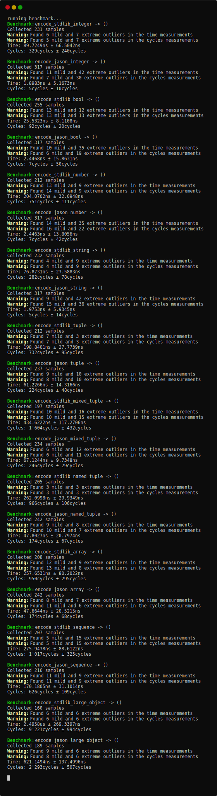
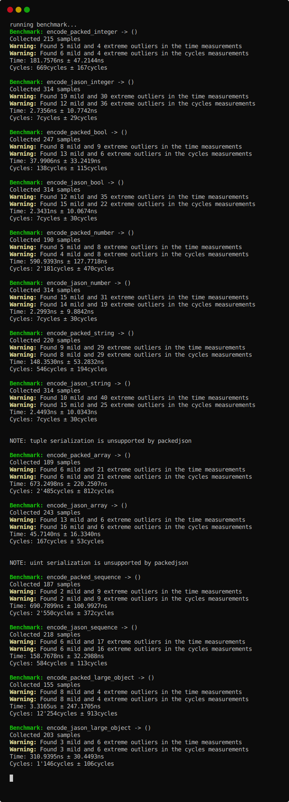
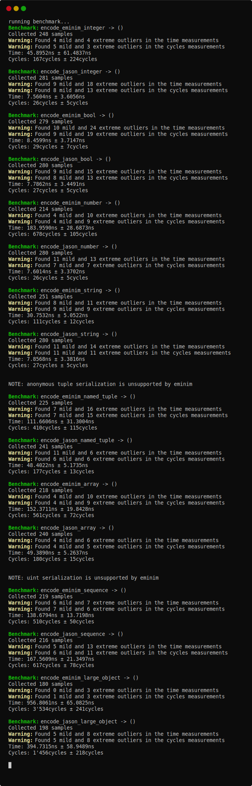

# jason

[](https://github.com/disruptek/jason/actions?query=workflow%3ACI)
[](https://github.com/disruptek/jason/releases/latest)

[](#license)
[](https://www.buymeacoffee.com/disruptek)

**mostly** compile-time JSON encoding

"I don't care." -- _Araq, 2020_

## Goals

Making some assumptions (ie. that our types aren't changing) allows...

- predictably fast performance
- predictably mild memory behavior
- predictably _idiomatic_ API
- **hard to misuse**

It's _fairly_ hard to misuse, but it's not fully optimized yet. In most cases,
it's faster than the standard library's `json` module. In rare cases, you may
find it a little slower.

Static values known at compile-time such as constants or macro outputs are
serialized at compile-time. [This is orders of magnitude faster than the
standard library](https://github.com/disruptek/jason#benchmarks).

But the main advantage is that you get JSON encoding of tuples, objects, and
iterators "for free" -- no serialization to implement and no duplication of
data.

Everything is type-checked, too, so there will be no runtime serialization
exceptions.

And, if you _want_ to implement custom serialization, it's now trivial to do so
for individual types. You can also implement custom compile-time serialization.

## Usage

```nim
# an integer
echo 45.jason                  # 45

# a float
echo jason(5.0)                # 5.0

# a bool
echo jason true                # true

# an enum (see below for custom serialization overriding)
echo Two.jason                 # 2

# a string
echo jason"foo"                # "foo"

# ref types are fine
echo jason((ref string) nil)   # null
```

Tuples without named fields become JSON arrays.  Tuples with named fields
become JSON objects.

```nim
echo (1, 2, 3).jason                       # [1,2,3]
echo (cats: "meow", dogs: "woof").jason    # {"cats":"meow","dogs":"woof"}
```

Objects are supported, with or without `ref` fields.

```nim
type
  O = object
   cats: string
   dogs: int
   q: ref O

let o = O(cats: "yuk", dogs: 2)
echo o.jason   # {"cats":"yuk","dogs":2,"q":null}
```

Custom serialization is trivial; just implement `jason` for your type.  No
need to guess as to whether you've implemented all necessary serializers;
if it compiles, you're golden.

```nim
type
  B = object
    x: int
    y: string
  C = seq[B]

let b = B(x: 3, y: "sup")
let c: C = @[ B(x: 1), B(x: 2), B(x: 3) ]

const a = B(x: 4, y: "compile-time!")

func jason(n: B): Json =
  if n.x mod 2 == 0: jason"even"
  else:              jason"odd"

# enabling compile-time encoding is easy
staticJason C

# or you can define static encoding yourself
macro jason(n: static[B]): Json =
  if n.x mod 2 == 0: jasonify"1"
  else:              jasonify"0"

check a.jason == "1"
check b.jason == """"odd""""
check c.jason == """["odd","even","odd"]"""
```

`Json` is a proper type.

```nim
var n: string = jason"foo"      # type error
var x: string = $"foo".jason    # ok
var y = jason"foo"              # ok
y.add "bif"                     # type error
```

## Benchmarks

### jason versus std/json

[The source to the benchmark is found in the tests
directory.](https://github.com/disruptek/jason/blob/master/tests/bench.nim)



### jason versus packedjson

[There is also a benchmark for the packedjson
library.](https://github.com/disruptek/jason/blob/master/tests/packed.nim)
**Note:** The primary reason to choose `packedjson` is low memory overhead
during *deserialization*.



### jason versus eminim

[This is a comparison with the eminim
library.](https://github.com/disruptek/jason/blob/master/tests/emi.nim) As
`eminim` serializes only to streams, we similarly issue a stream write in the
`jason` benchmarks here, so that fair comparison may be made.



## Installation

```
$ nimph clone jason
```
or if you're still using Nimble like it's 2012,
```
$ nimble install https://github.com/disruptek/jason
```

## Documentation

I'm going to try a little harder with these docs by using `runnableExamples`
so the documentation demonstrates _current_ usage examples and working tests.

[See the documentation for the jason module as generated directly from the
source.](https://disruptek.github.io/jason/jason.html)

## License
MIT
